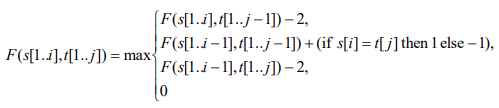

# DNA Locality

The purpose of this application is to look for occurrences of a small segment of DNA in a larger sequence. The best fit 
is determined, taking into account insertions and deletions.

## Approach

Smith-Waterman algorithm

