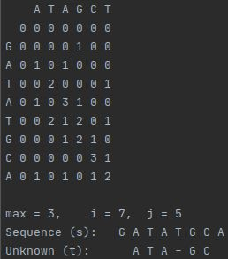
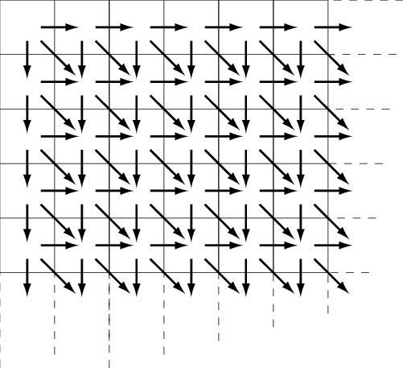
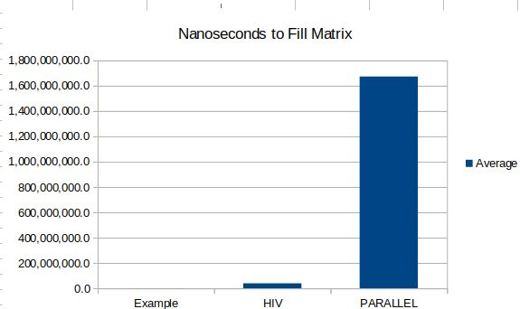
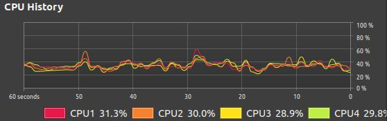

# DNA Locality

The purpose of this application is to look for occurrences of a small segment of DNA in a larger sequence. The best fit 
is determined, taking into account insertions and deletions.

## Approach

Smith-Waterman algorithm is a method of performing a local sequence alignment, that is, it is used to determine
similar regions between two nucleic acid or protein sequences. In the case of this project, I examined two sets.
The first, an example set, is used for proving correct execution since it's small enough to compute by hand. The 
second set is an HIV-1 sequence and Polymerase.

Each cell in the first row and column of the matrix is initialized to 0, and cells are then calculated based upon
the following max function where i represents the row and j the column. Once the matrix has been filled, I start at the 
highest value (tie-breaking takes the lowest right score) and follow backwards to record the best match until a
0 score is reached.


Terminal output from this application includes the nanoseconds used to fill the matrix, and optionally,
the output below to a file. The matrix is drawn with the test protein along the top and the DNA sequence 
examined down the left side of the matrix. After the matrix, I show the alignment and and insertions /
deletions as well as the max score and strand start coordinates.



I created omp task dependencies on the West, North, and Northwest cells from the cell being 
calculated and let omp handle the dependency graph. The the boxes below each represent a task, 
and the arrows are dependencies tracked by the framework.    



Directional scoring is accomplished all inside each task. A task is also responsible for determining the
max score (including zero) and writing the result to its own dedicated place in a pre-allocated matrix.

```
    // F(s[1..i],t[1..j-1])-2
    Score westScore = {West, matrix[i][j - 1] - 2};
    scores.push_back(westScore);

    // F(s[1..i-1],t[1..j-1])+(if s[i]=t[j] then 1 else - 1)
    // '?' is a wildcard and always matches the other value
    int predicate = (strandS[i] == strandT[j] || strandS[i] == '?' || strandS[j] == '?')
                    ? 1 : -1;
    Score northwestScore = {Northwest, matrix[i - 1][j - 1] + predicate};
    scores.push_back(northwestScore);

    // F(s[1..i-1],t[1..j])-2
    Score northScore = {North, matrix[i - 1][j] - 2};
    scores.push_back(northScore);
```

Determining that these prerequisites are available is accomplished through use of an omp directive below. 
The directive defines variables that a task uses as inputs and outputs. Then the omp code schedules the 
tasks in an order that satisfies the dependency graph. Creating this dependency graph does take time, so 
each task needs to accomplish enough work for this approach to be worth taking.

```
#pragma omp task \
    shared(i, strandS, strandT, j) \
    depend(in:this->matrix[i - 1][j], this->matrix[i][j - 1]) \
    depend(out:this->matrix[i][j]) \
    default(none)
```

Writing to shared memory to record a new best score requires single thread access, which is 
accomplished via critical sections.

```
#pragma omp critical
{
    if (max.Value >= best.Value) {
        best.Location = {.i = i, .j = j};
        best.direction = max.direction;
        best.Value = max.Value;
    }
};
```

## Results

As you can see with the table below, my speedup with four threads
was actually a 42x slowdown (average sequential time divided by average parallel 
time). This is likely due to the tasks being more 
expensive to schedule than the time saved by chunking them up. This is normally 
solved by making tasks less granular, but when a task has dependencies in three 
directions, this is difficult.



| (ns)    | Example  | HIV-SERIAL   | HIV-PARALLEL(4) |
|---------|----------|--------------|-----------------|
| Average | 6,872.8  | 39,222,340.2 | 1,672,646,131.6 |
| Min     | 5,931.0  | 37,069,728.0 | 1,543,495,727.0 |
| Max     | 10,620.0 | 50,267,424.0 | 1,884,633,044.0 |

Had I been able to achieve any measure of speedup, I would have also 
benchmarked on a machine with more cores with lower utilization. My development 
machine has only 4 cores and the UI and dev tools keep them somewhat busy,
as you can see below. A machine with more cores and lower baseline usage 
would see a smaller variance between min and max values of run times. 

